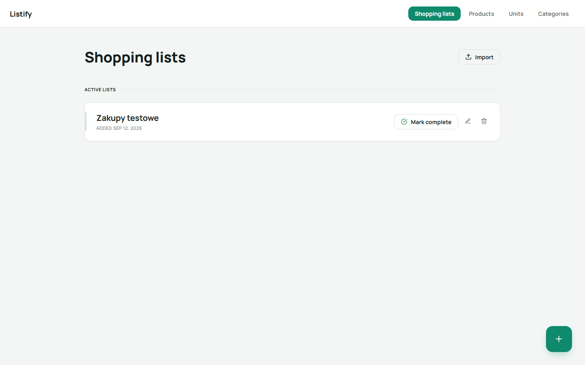
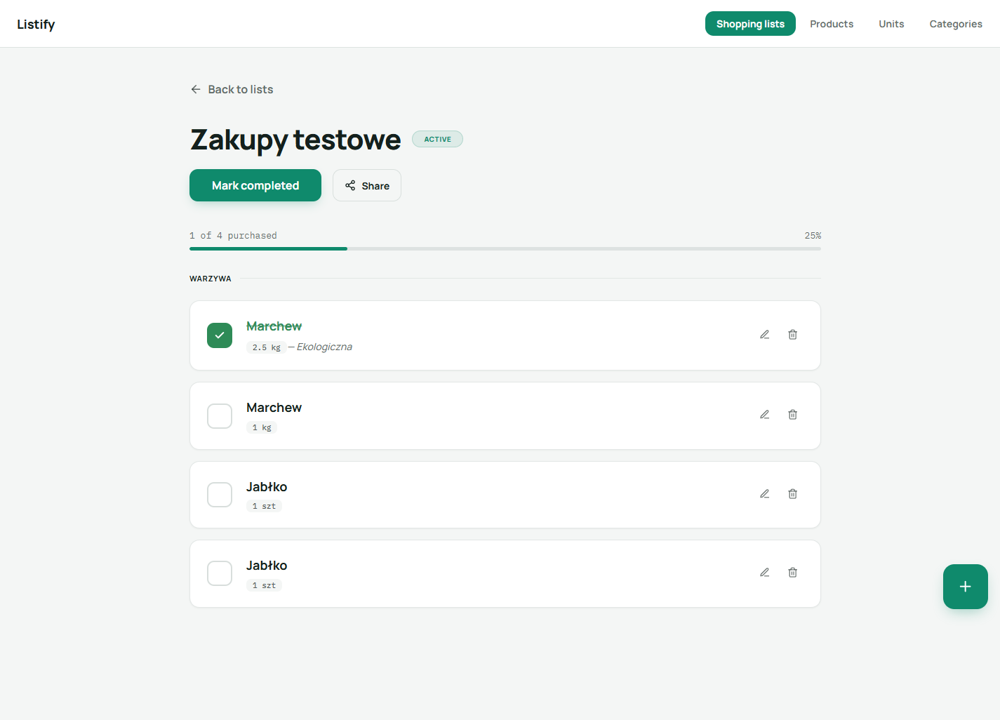
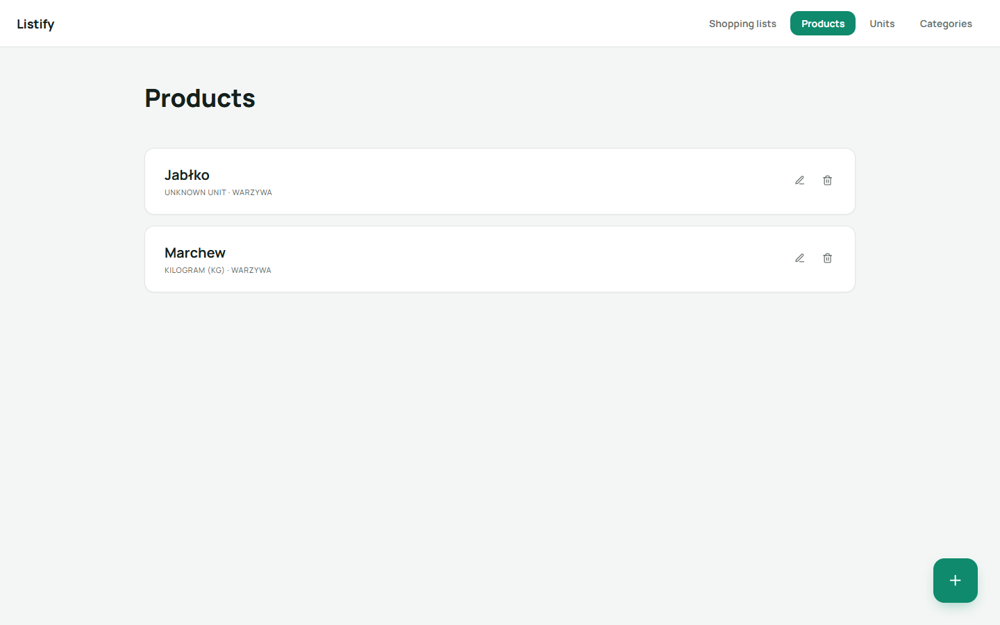
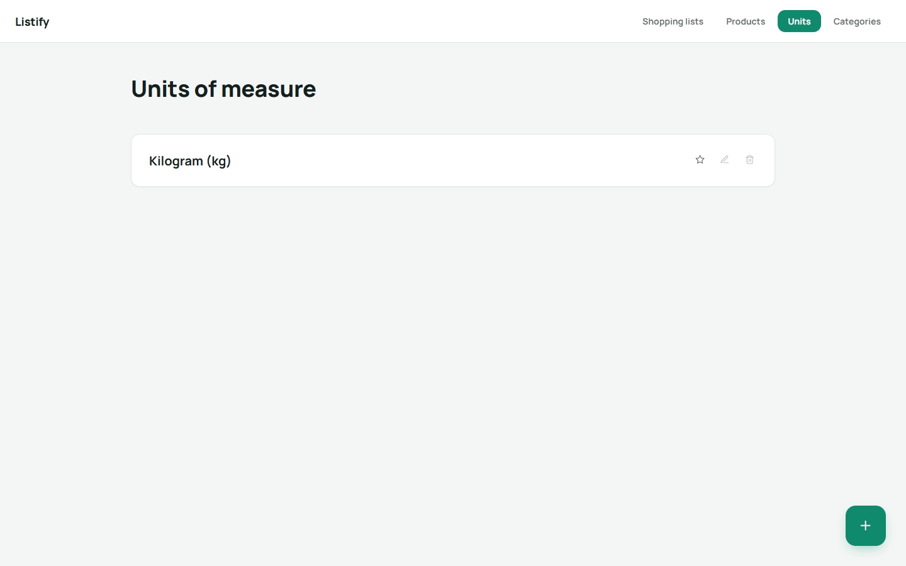
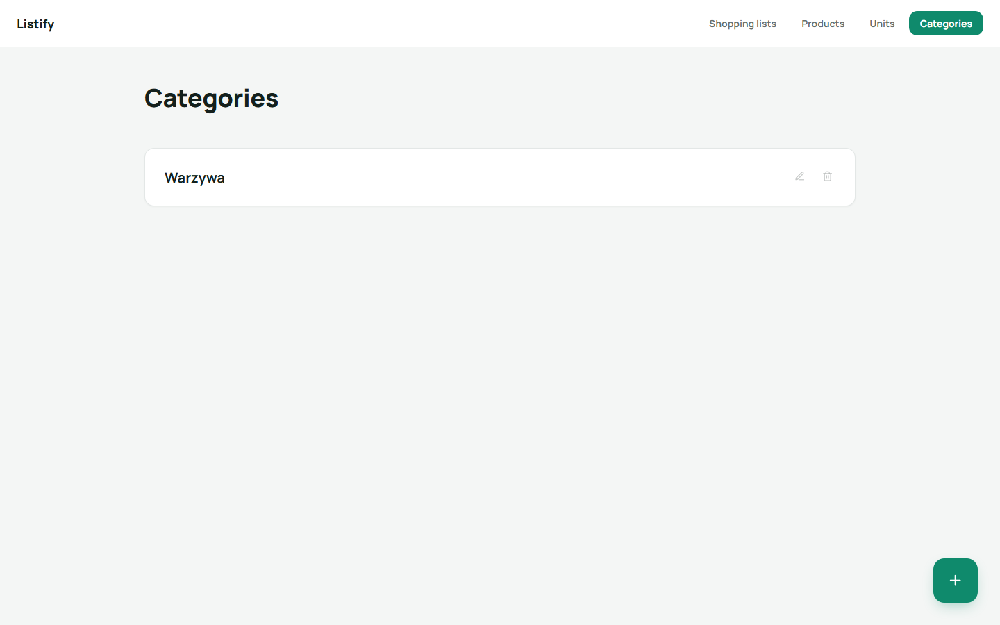

# Przegląd aplikacji

Listify to aplikacja do zarządzania listami zakupów, produktami, jednostkami miary i kategoriami. Poniżej znajduje się krótki przegląd głównych widoków aplikacji wraz ze zrzutami ekranu.

## Listy zakupów

Widok główny aplikacji — pozwala tworzyć, edytować, oznaczać jako ukończone oraz usuwać listy zakupów.

### Szczegóły listy zakupów

Po wejściu w konkretną listę użytkownik widzi produkty pogrupowane według kategorii, może odznaczać zakupione pozycje i śledzić postęp realizacji listy.

## Produkty

Zarządzanie słownikiem produktów wraz z przypisaną jednostką miary i kategorią.

## Jednostki miary

Zarządzanie jednostkami miary używanymi przy produktach (np. kilogram, sztuka). Jedną z jednostek można oznaczyć jako domyślną.

## Kategorie

Zarządzanie kategoriami, do których przypisywane są produkty.

