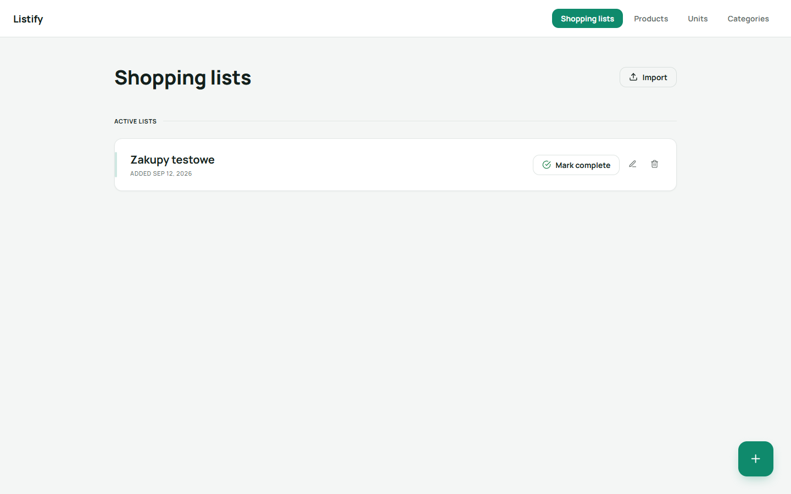
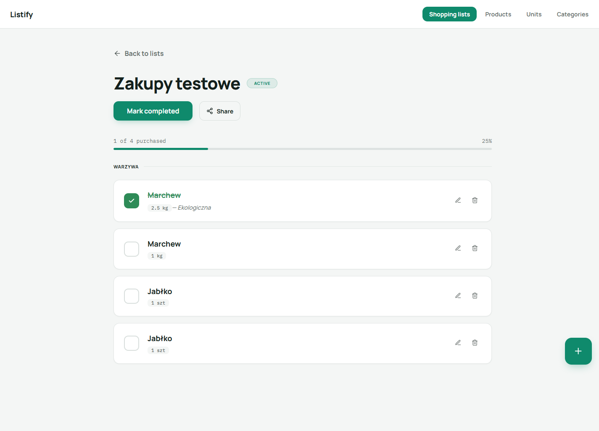
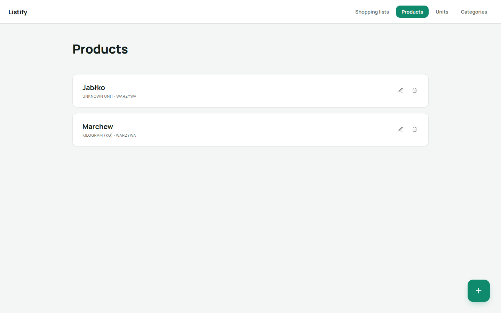
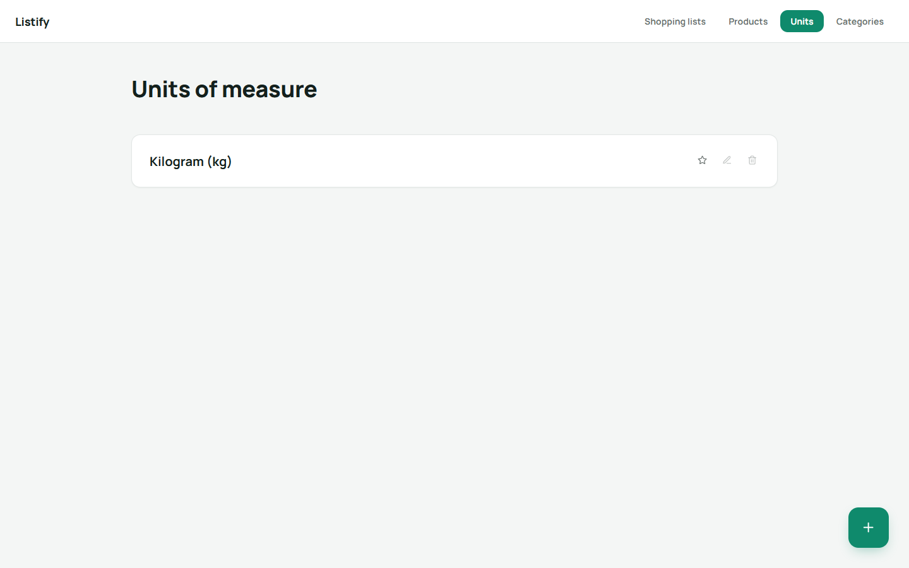
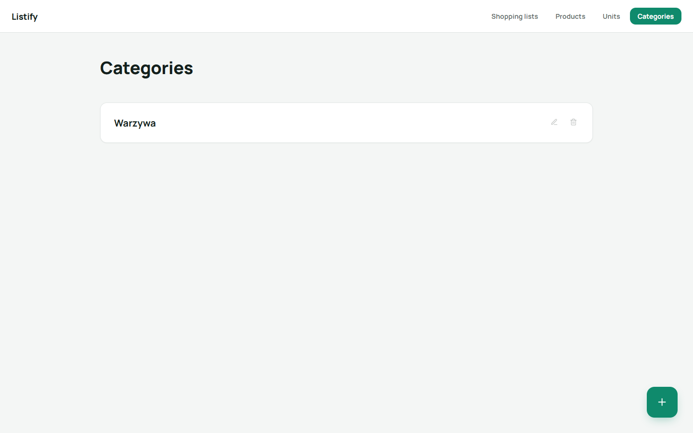

# Application overview

Listify is an application for managing shopping lists, products, units of measure, and categories. Below is a short overview of the application's main views, with screenshots.

## Shopping lists

The main view of the application — lets you create, edit, mark as complete, and delete shopping lists.

### Shopping list detail

Opening a specific list shows its products grouped by category. Users can check off purchased items and track the list's completion progress.

### Sharing a shopping list

The owner of a list can share it with other accounts through an invite link, available in the list's Share dialog (copy the link, send it, or generate a new one). Anyone who is signed in and opens the link joins the list.

- Members can add, edit, remove, and check off items, and change the list's status (complete or restore it). They cannot rename or delete the list, and they can leave it at any time.
- The owner sees the list's members and can remove them, optionally invalidating the link at the same time. Generating a new link makes the old one stop working; existing members keep their access.
- In the overview, shared lists are marked "Shared by …" (for members) or "Shared · N other members" (for the owner).
- File export and import are unchanged (the export button is now labelled "Export").

## Products

Manage the product dictionary, each product with an assigned unit of measure and category.

## Units of measure

Manage the units of measure used by products (e.g. kilogram, piece). One unit can be marked as the default.

## Categories

Manage the categories that products can be assigned to.

